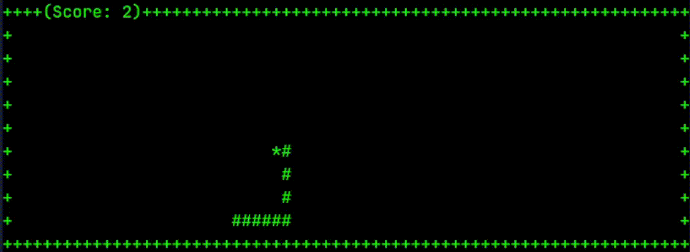
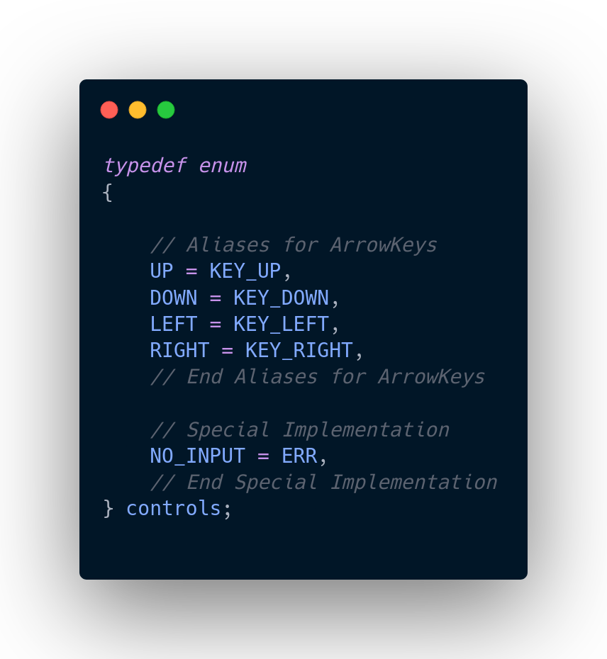

# Snakes 🐍

## 🎮 How to Play:
---
Players navigate the snake using arrow keys or specified controls, guiding it to consume food items randomly placed within the game area. As the snake consumes food, it grows longer, making navigation more challenging. The game ends if the snake collides with itself or the boundaries, and players can see their score.

## 🕹️ Controls:
---
- Use the arrow keys to control the snake's movement:
  - **Up Arrow**: Move the snake upwards.
  - **Down Arrow**: Move the snake downwards.
  - **Left Arrow**: Move the snake to the left.
  - **Right Arrow**: Move the snake to the right.
  
- For changes to controls, modify the controls enum inside `src/header files/control_module.h`.

## ✨ Features:

- **Terminal Theme Adjustment**: The game adjusts to your terminal theme, ensuring it matches your taste straight on without any additional configurations.

- **Customization via Flags**: Customize your gaming experience by passing flags to adjust various settings according to your preferences.

- **Theme Customization**: Want to add your own theme? No problem! Simply adjust the source files in `src/source files/theme_module.c` to append your personalized theme to the game.

