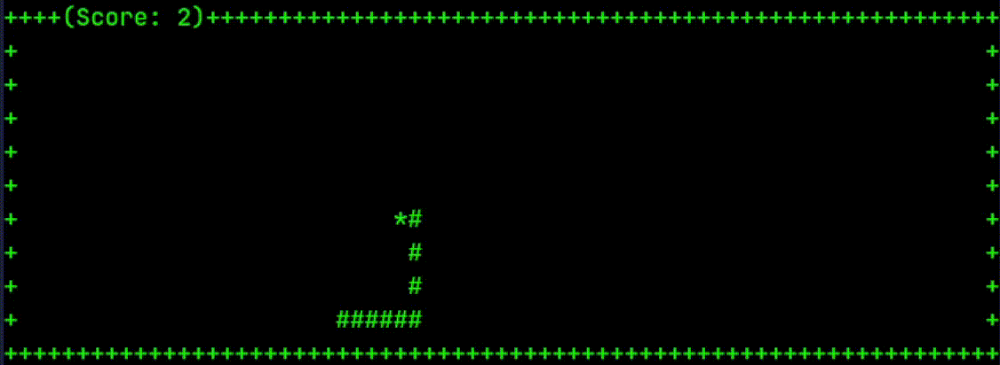
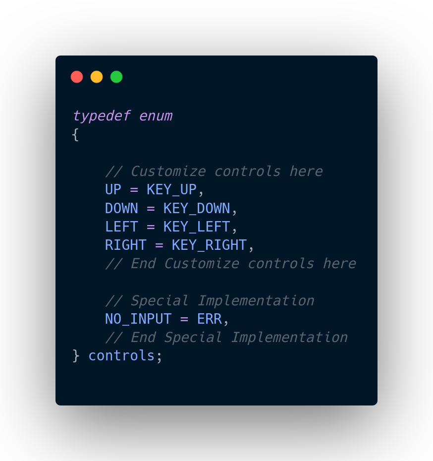
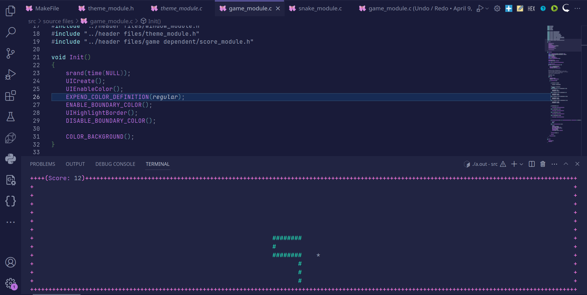
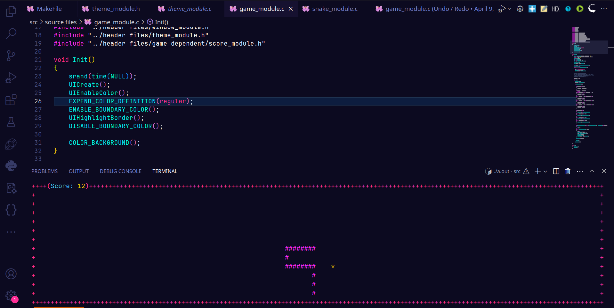
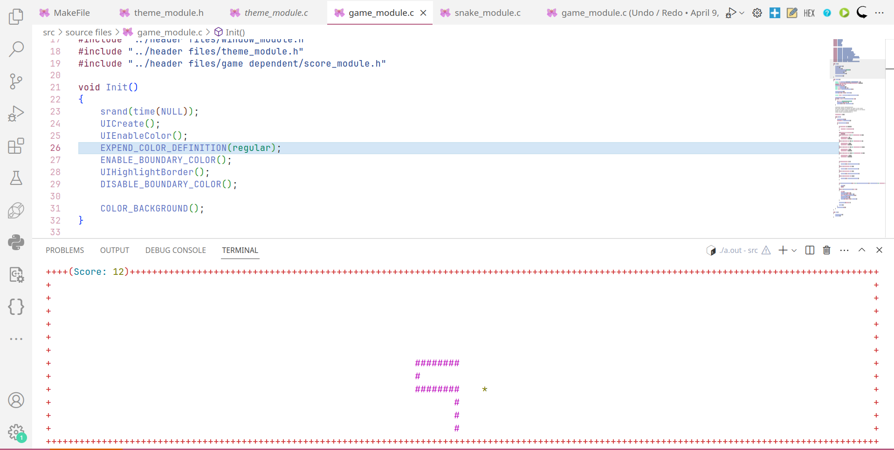

# Snakes 🐍



## 🎮 How to Play:

Players navigate the snake using arrow keys or specified controls, guiding it to consume food items randomly placed within the game area. As the snake consumes food, it grows longer, making navigation more challenging. The game ends if the snake collides with itself or the boundaries, and players can see their score.

## 🕹️ Controls:

- Use the arrow keys to control the snake's movement:
  - **Up Arrow**: Move the snake upwards.
  - **Down Arrow**: Move the snake downwards.
  - **Left Arrow**: Move the snake to the left.
  - **Right Arrow**: Move the snake to the right.
  
- For changes to controls, modify the controls enum inside `src/header files/control_module.h`.



## ✨ Features:

- **FPS Cap Customization**: Take control of the game's speed by adjusting the frames per second (FPS) cap. Ideal for larger monitors where quicker snake movement enhances gameplay, Simply adjust the source file in `src/header files/settings_module.h`.

- **Terminal Theme Adjustment**: The game adjusts to your terminal theme, ensuring it matches your taste straight on without any additional configurations.

- **Customization via Flags**: Customize your gaming experience by passing flags to adjust various settings according to your preferences.

- **Theme Customization**: Want to add your own theme? No problem! Simply adjust the source file in `src/source files/theme_module.c` to append your personalized theme to the game.

<p align="center">
  
  
  
</p>

## 📦 Run/Compile:

To compile and run the Snake Game, you'll need any C compiler with the standard library and ncurses library installed. Follow these steps:

1. **Compile from Source**:
   - Ensure you have a C compiler installed on your system.
   - Make sure the ncurses library is also installed. You can typically install it using your package manager.
   - Navigate to the project directory and run `make` to build the project.

2. **Run the Compiled Binary**:
   - After successful compilation, execute the compiled binary by entering:
     ```bash
     ./snake.out
     ```

3. **Run the Precompiled Binary**:
   - If you prefer not to compile the game yourself, follow these steps:

     a. Navigate to the `release` folder:
        ```bash
        cd release
        ```

     b. Run the precompiled binary:
        ```bash
        ./snake.out
        ```

     Remember to grant necessary permissions to the binary if needed:
     ```bash
     chmod +x snake.out
     ```
## ❤️‍🔥 Acknowledgment:

Special thanks to [@haydraa](https://github.com/haydraa 'haydraa profile') for dedicating time and effort to review the code, providing valuable feedback, and contributing to the improvement of the Snake Game.

<br/>

<p align="center">Made with ❤️ in Tunisia 🇹🇳</p>
